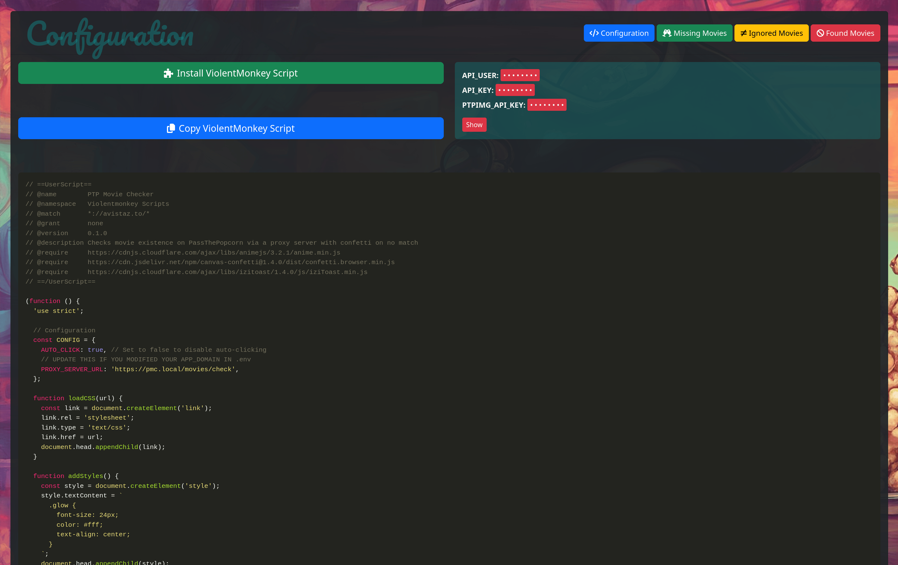

# PTP Movie Checker

PTP Movie Checker is a tool designed to help PassThePopcorn (PTP) users discover movies that aren't currently available
on the site. It automatically scans web pages for IMDB links, checks their availability on PTP, and manages the results.

Installation page:



Missing Movies page:


## Quick Start

1. Clone the repository and set up environment:
   ```sh
   git clone https://github.com/codddarrr/ptp_movie_checker.git
   cd ptp_movie_checker
   cp .env.dist .env
   ```
2. Configure your `.env` file (see [Configuration](#configuration) for details)
3. Start the application: `docker-compose up`
4. Add `127.0.0.1 pmc.local` to your `/etc/hosts` file
5. Visit https://pmc.local and install the ViolentMonkey script

## Table of Contents

- [Key Features](#key-features)
- [How It Works](#how-it-works)
- [Prerequisites](#prerequisites)
- [Installation](#installation)
- [Configuration](#configuration)
- [Usage](#usage)
- [Setting Up Proxy for Strict CSP](#setting-up-proxy-for-strict-csp)

## Key Features

- Automatically detects IMDB links on web pages
- Checks movie availability on PassThePopcorn via IMDB search
- Manages lists of missing, ignored, and found movies
- Uploads movie posters to PTPImg for easy reference
- Provides a ViolentMonkey script for seamless integration with private trackers
- Includes a proxy server to bypass strict Content Security Policies (CSPs)

## How It Works

1. You install a ViolentMonkey script in your browser and run a local server using Docker.
2. On enabled sites, the script automatically detects IMDB links and checks movie availability on PTP.
3. For available movies, it inserts a link to the PTP movie page.
4. For missing movies, it adds them to your database, including the movie poster uploaded to PTPImg.
5. You can review the list of missing movies, mark them as checked, ignore them, add tags, or search for them on PTP.
6. You can check for banned movies, release groups and release types, allow you to filter out movies that are not
   allowed on PTP.
7. Once you have your list of missing movies, you can acquire the torrent file from the original tracker.

## Prerequisites

- [Docker](https://www.docker.com/get-started)
- [Docker Compose](https://docs.docker.com/compose/install/)
- [ViolentMonkey](https://violentmonkey.github.io/)

## Installation

1. **Clone the Repository:**
   ```sh
   git clone https://github.com/codddarrr/ptp_movie_checker.git
   cd ptp_movie_checker
   ```

2. **Setup Environment Variables:**
   ```sh
   cp .env.dist .env
   ```
   Edit the `.env` file with your credentials (see [Configuration](#configuration) for details).

3. **Build and Start the Docker Container:**
   ```sh
   docker-compose up
   ```

## Configuration

Edit the `.env` file with the following information:

- `API_USER` and `API_KEY`: Obtain from https://passthepopcorn.me/user.php?action=edit_security
- `PTPIMG_API_KEY`: To obtain this key:
    1. Visit https://ptpimg.me/ and login
    2. View the page source and search for "api_key"
    3. Copy the value from the line: `<input id="api_key" type="hidden" name="api_key" value="PTPIMG_API_KEY" />`
    4. Paste this key into your `.env` file

Keep your API keys confidential as they provide access to your accounts.

## Usage

1. **Add local /etc/hosts Entries:**
   Edit your hosts file (located at `/etc/hosts` on Linux/MacOS or `C:\Windows\System32\drivers\etc\hosts` on Windows)
   as an administrator. Add `pmc.local` to the line starting with `127.0.0.1`. It should look like:
   ```
   127.0.0.1 localhost pmc.local
   ```

2. **Access the Proxy Server:**
   Open your browser and go to https://pmc.local. Accept the self-signed certificate.

3. **Install the ViolentMonkey Script:**
   Click the ViolentMonkey installation link on the homepage. Review the script before installing.

4. **Using the Script:**
   The script adds a button next to IMDB links on supported pages. It automatically checks movies and adds missing ones
   to your database.

5. **Manage Movies:**
   Visit https://pmc.local/movies/missing to:
    - Mark movies as checked (✔)
    - Filter the list to show only unchecked movies
    - Move checked movies to your local ignored list
    - Recheck all movies by their IMDB ID
    - Edit movie details, including adding and searching through tags

## Setting Up Proxy for Strict CSP

For websites with strict Content Security Policies (CSPs) that prevent the ViolentMonkey script from functioning:

1. **Update the `PROXY_DOMAINS` Environment Variable:**
   In your `.env` file, add or modify the `PROXY_DOMAINS` variable:
   ```
   # sometimes, the website you're trying to proxy will have preloaded HSTS set up, which means your browser will not 
   # play nice with the proxy. in such cases try to find an alternative domain for the site, or, ping it and try accessing
   # the ip directly. if that works, then set the `target_domain` to the alternative / IP address, and the original hostname
   # to the original domain of the site you're proxying.
   PROXY_DOMAINS='[
     {
       "proxy_domain": "pmc-example.com",
       "target_domain": "example.com",
       "original_hostname": "example.com"
     }
   ]'
   ```
   Replace `example.com` with the domains you need to proxy. For sites with preloaded HSTS, try using an alternative
   domain or IP address for `target_domain`.

2. **Update Your Hosts File:**
   Add entries to point the `proxy_domain` to your local machine:
   ```
   127.0.0.1 localhost pmc.local pmc-example.com 
   ```

3. **Restart the Docker Container:**
   ```sh
   docker-compose down
   docker-compose up
   ```

4. **Access the Proxied Sites:**
   Use https://pmc-example.com instead of https://example.com

These proxied versions will have relaxed CSP settings, allowing the ViolentMonkey script to function properly.
